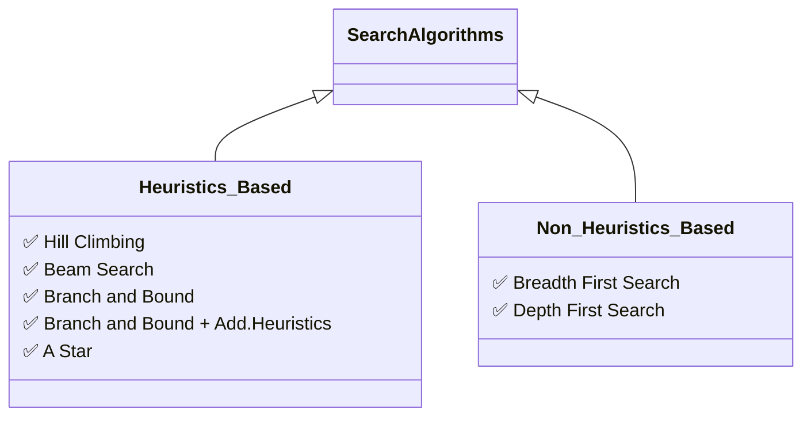

# AI-Algorithm-Visualisation

A Search Algorithm Visualization tool created as a part of my miniproject. Visit this [page](https://hwaseem04.github.io/AI-Algorithm-Visualisation/) to use the tool.

Following Algorithms are available in this tool (subjected to change/added)

### Methodology
* HTML, CSS-Bootstrap are used for webpage layout. 
* To carry out event handling, [brython](https://www.brython.info/) - A Transcompiler from python code to javascript is used (Pretty good though).

### Usage

* Watch this short [Youtube video](https://youtu.be/Q3MnSeCIi_w) to check out how to use it.

### Files

Haven't documented entire code, will do it sometime sooner.

* `main.py` - Has code for Drawing graph, Updating graph, Event handling etc.
* `Node.py` - Has a class *Node* used to define the attributes of a node in graph.
* `SearchAgent.py` - Graph of the Agent is defined here along with its attributes. All the algorithms is written here (Quite messy to make the visualisation prettier).
* `SavedGraph.py` - (In progress)Has few ready made graphs for simplicity. Will add more graph in it later. 
    * If you want to add your own graph to it, make a pull request by modifying the file with your own graph.
* `index.html` - Defined the layout of my webpage. It has the script linking to brython.
* `styles.css` - CSS goes here. Not much is used. Subject to change sooner.

### Bugs / Improvements

* Feel free to report bugs, either in code itself or in algorithm.
* Also welcomed for Algorithm optimisation.
* Make a PR, if you want to add more **default graphs**.